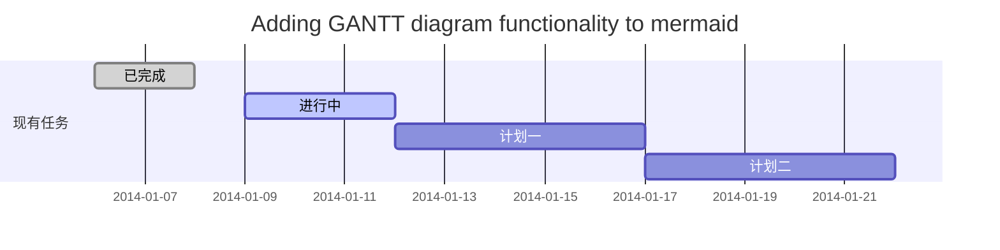
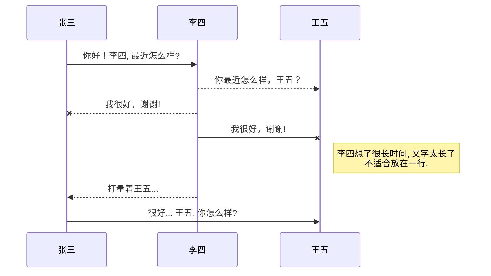
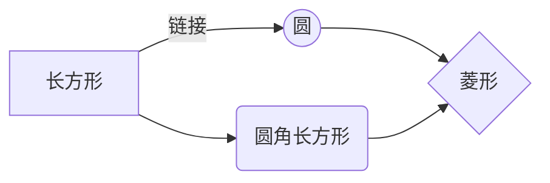

# 一级# 文章标题
## _二级## 倾_斜_菜单_

==标记文本==
~~删除文本~~
小字 H~2~O 
幂2^10^
- [ ] 勾选框
- [x] 勾选框

外链[csdn](https://www.csdn.net/)


### 子菜单
- v1 item 项 * - + 空格
- v1 一级同符号相邻 否则额外行距
	+ v2 ✨支持缩进 ✨
		* v3 ✨ ✨
	+ v2 ✨Magic ✨

空行隔离  **分割线上空行**

---
### 引用 
[引用文献] 间隔字符串! [提示语=默认引用文献名 可指定引用][引用文献] 
> markdown标准规范问题
> [融合规范01 编辑器 dillinger.io] 
> [融合规范02 编辑器 csdn] 
> 引用标记行2  `行内部代码段`
不换行不隔离 

### 代码段
```bash
echo 代码段
while echo ls
```
### 表格
id | name | age 
 - | - | - 
1 | [plugins/dropbox/README.md][PlDb] |  15
2 | [plugins/github/README.md][PlGh] |

#### 文献引用清单
[//]: # (注释)
[name]:<url>
[引用文献]: <http://www.baidu.com?wd=引用>
[融合规范01 编辑器 dillinger.io]: <https://dillinger.io/>
[融合规范02 编辑器 csdn]: <https://blog.csdn.net/>


---

# csdn语法

*[HTML]:   超文本标记语言


<kbd>加框文本</kbd>
## 新的甘特图功能，丰富你的文章


- 关于 **甘特图** 语法，参考 [这儿](https://mermaidjs.github.io/),


## UML 图表

可以使用UML图表进行渲染。 [Mermaid](https://mermaidjs.github.io/). 例如下面产生的一个序列图：



这将产生一个流程图。:



- 关于 **Mermaid** 语法，参考 [这儿](https://mermaidjs.github.io/),

## FLowchart流程图

我们依旧会支持flowchart的流程图：
```mermaid
flowchat
st=>start: 开始
e=>end: 结束
op=>operation: 我的操作
cond=>condition: 确认？

st->op->cond
cond(yes)->e
cond(no)->op
```

- 关于 **Flowchart流程图** 语法，参考 [这儿](http://adrai.github.io/flowchart.js/).
